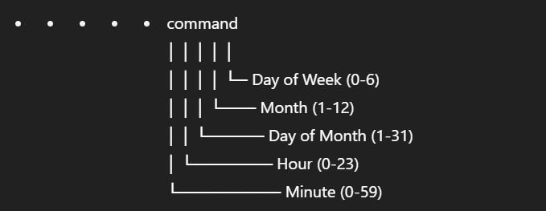

# ⏰ Cron Jobs (Scheduled Tasks)

- `crontab -e` – Edit cron jobs
- `crontab -l` – List cron jobs
- `crontab -r` – Remove all cron jobs

## 🧭 Cron Format:



### 🧪 Example:

```bash
0 2 * * * /home/user/backup.sh
```
